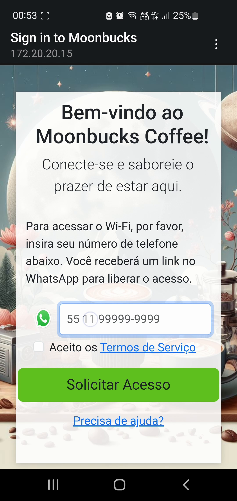
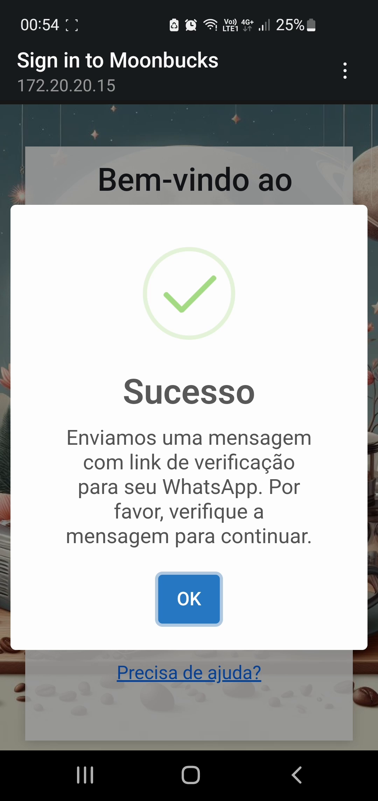
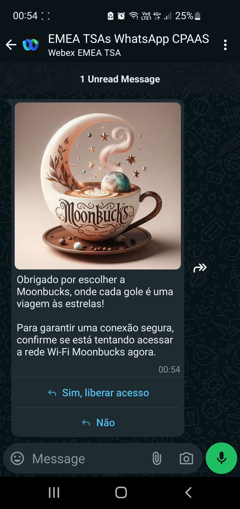
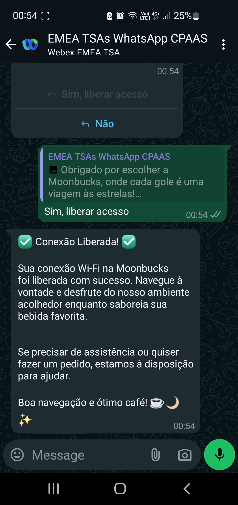

# WebexConnect-Meraki-splashpage

## Overview
This project aims to enhance client communication for retail and other businesses by leveraging Wi-Fi splash portals as a means to initiate WhatsApp conversations for sending promotions. By integrating with the Meraki Splash Portal and Webex Connect, we provide businesses with a seamless way to engage with customers, offer personalized experiences, and promote their products or services. Additionally, we also focus on recognizing individuals accessing the network to adhere to the laws outlined in the Brazilian Marco civil da Internet legislation.

## Team

Cisco Innovation Labs

## Introduction

In this guide, you will be taken step by step through the process of configuring a WiFi splashpage application utilizing Meraki along with Webex Connect CPaaS solution. The application is comprised of four key services: WebServer, Openldap, Account Manager for openldap management and sending WhatsApp authorization messages via Webex Connect

## Requirements

Before proceeding with the setup, make sure you have the following requirements:

- Docker and Docker Compose installed. This machine must be accessible by the AP and by the Guest network.  
- Meraki network with at least one Access Point
- A Webex Connect account with Whatsapp, If using the sandbox you will only be able to send message to yourself

## additional

- (Optional) Domain Name for the Wifi splashpage.

## Limitations

- This application is not ready for production still need some security checks listed in the roadmap.

## Features
- **Wi-Fi Splash Portal**: Customized landing page for Wi-Fi users.
- **WhatsApp Messaging**: Utilize Webex Connect to verify client identity via whatsapp.
- **Personalized Customer Interaction**: Ability to send targeted promotions based on customer preferences and behavior.

# Setup Instructions

## Step 1: Clone the Repository

Clone the repository containing the Docker Compose file and the necessary configurations.
Open a terminal and navigate to the cloned repository.

```sh
git clone [repository-url]
cd [repository-directory]
```


## Step 2: Configure the Environment Variables

Open the .env-sample file rename to .env and update the following environment variables :

- ACCOUNTMANAGER: Set the URL of the Account Manager service (default: http://accountmanager:8080).
- WEBEXCONNECT_HOOK_URL: Set the Webex Connect hook URL for event notifications.
- WEBEXCONNECT_KEY: Set your Webex Connect API key.
- LDAP_URL: Set the LDAP URL for the Meraki network.
- LDAP_ROOT: Set the root domain for the LDAP server.
- LDAP_ADMIN_USERNAME: Set the LDAP admin username.
- LDAP_ADMIN_PASSWORD: Set the LDAP admin password.
- LDAP_USERS_OU: Set the Organizational Unit (OU) for LDAP users.
- CERT_SUBJECT: Set the certificate subject for HTTPS connections.

## Step 3: Configure Meraki Network

[Meraki documentation](https://developer.cisco.com/meraki/captive-portal-api/sign-on-api/)

## Step 4: Configure Webex Connect

[Webex Connect Documentation](https://help.imiconnect.io/docs/welcome)
## Step 5: Start the Services

Run the following command to start the Docker services:

```
docker-compose up
```

## Step 6: Verify the Setup

Open a web browser and access the splashpage application using your domain name and the configured port (e.g., http://yourdomain.com:8085).
Verify that the splashpage is working correctly and displays the necessary information.

### Splash Page 




### WhatsApp





# Summary of Services

## WebPage Service

The WebPage service provides the front-end for the WiFi splashpage application. It consists of PHP, HTML, CSS, and JavaScript files. You can customize the appearance and content of the splashpage by modifying these files.

- Nginx: Serves the splashpage application.
- PHP-FPM: Runs the PHP scripts for the WebPage service.

## Account Manager Service

The Account Manager service handles the management of openldap accounts. It allows you to create and manage user accounts for authentication and authorization purposes. It also is responsible for sending WhatsApp messages via the Webex Connect CPaaS solution to validate user account.

# Webex Connect 

[Webex Connect](https://cpaas.webex.com/) is a CPaaS service. It is responsible for validating the guest identity using whatsapp. 

# Meraki

[Meraki](https://meraki.cisco.com/) is a platform responsible for creating and managing Networks. It is responsible for providing the guest Wifi network.

## Other Supporting Services

- Cert-gen: Generates SSL/TLS certificates for secure connections.
- OpenLDAP: Provides LDAP services for user authentication and authorization.
- Keycloak (Optional): Service for identity and access management.
- Postgresql (Optional): Required by keycloak.

# Roadmap

1. Install OpenTelemetry for application monitoring:

- Integrate OpenTelemetry to enable application-level monitoring and performance tracking.
- Collect and analyze metrics, traces, and logs to gain insights into the application's behavior and performance.
  
2. Implement user interface improvements:

- Enhance the user interface with validation messages, error handling, and feedback to guide users through the authentication process.
- Improve the overall user experience by providing clear instructions and intuitive user interactions.
- Implement localization and internationalization:

3. Add support for localization and internationalization to cater to users from different regions or languages.
- Provide a localized experience by adapting the user interface, messages, and content to the user's preferred language or region.

4. Create a monitoring service:
Develop a new service that monitors when users connect or reconnect to the network. Then trigger a Welcome message or notification to the user.
Monitor the network to detect when a user leaves. Send a good bye message or notification.

# External Documentation

https://developer.cisco.com/meraki/captive-portal-api/sign-on-api/
https://documentation.meraki.com/General_Administration/Cross-Platform_Content/Splash_Page
https://documentation.meraki.com/MR/MR_Splash_Page/Configuring_Splash_Page_Authentication_with_an_LDAP_Server